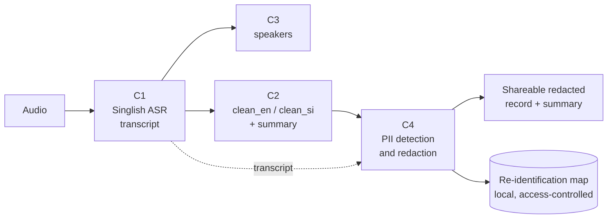
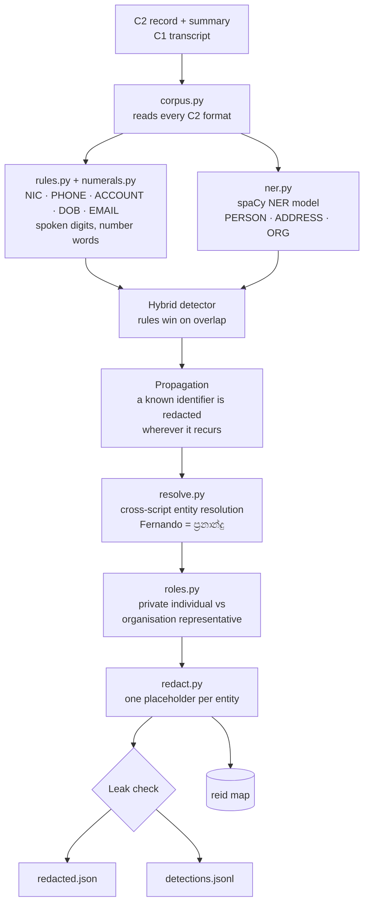

# C4 Architecture — Offline PII Detection and Redaction

J26-DS-313 · Component 4 · O. S. Jayathilaka (IT23247390)

## Position in the SORA system

**If C4 is removed,** the record cannot be shared: every name, NIC, phone
number and account in it stays exposed.

## Input and output contract

| | What | Format |
|---|---|---|
| **Input** | C2 single-language record and summary; C1 transcript when present | `<rid>.translation.json`, `<rid>.summary.json`, `<rid>.transcript.json` |
| **Output 1** | Redacted shareable documents, one placeholder per entity everywhere | `out/<rid>.redacted.json` |
| **Output 2** | Every detected span (metadata only, no surfaces) | `out/<rid>.detections.jsonl` |
| **Output 3** | Re-identification map, written only to git-ignored local storage | `reid_map/<rid>.reid.json` |

Run with: `python src/pipeline.py --recording <rid>`

## Inside C4

| Module | Responsibility | Requirement |
|---|---|---|
| `numerals.py` | decode / encode spoken Sinhala, romanised and English numbers | FR3, FR4 |
| `rules.py` | structured identifiers by format and keyword context | SO3, FR4, NFR7 |
| `ner.py` | learned PERSON / ADDRESS / ORG detection; hybrid with the rules | SO4, FR2 |
| `resolve.py` | cross-script entity resolution | SO5, FR5 (Contribution 2) |
| `roles.py` | person-role classification | FR7 |
| `redact.py` | consistent placeholders, propagation, leak check, re-id map | FR6, FR8, NFR2, NFR6 |
| `pipeline.py` | end-to-end command; offline guard; latency and memory | FR1, FR9, NFR1, NFR4, NFR5 |
| `demo.py` | local web demo for the panel | — |

## Supporting tooling

| Module | Purpose |
|---|---|
| `synthetic.py` | synthetic train and held-out test data from Sri Lankan identifier formats |
| `validate.py` | schema and integrity checks (offsets, overlaps, cross-script links) |
| `evaluate.py` | strict-span evaluation per label, script and document (FR10) |
| `presidio_baseline.py` | Microsoft Presidio comparison (SO2) |
| `SORA_Dataset/scripts/c4/fix_c4_annotations.py` | deterministic repair of the C4 annotation layer |

## Technology choices

| Choice | Reason |
|---|---|
| **Rules for structured identifiers** | Fixed Sri Lankan formats (NIC, phone) are learnable without data and must be editable without retraining (NFR7). |
| **spaCy CNN NER on CPU** | Trains in about 30 minutes on a laptop with no GPU. The proposal's xlm-roberta-base needed 110–130 s per step on CPU and stays the GPU upgrade path. |
| **Transliteration + phonetic similarity** for linking | No parallel name data exists; a romaniser plus phonetic keys works offline with no training. |
| **Logistic regression** for roles | Small labelled set (203 real people); interpretable features. |
| **Python standard library web server** for the demo | No internet and no extra dependencies at PP1. |
